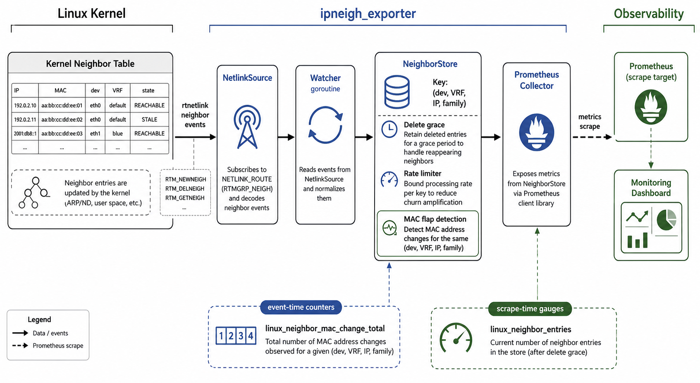

# ipneigh_exporter

[](https://claude.ai/claude-code)
[](LICENSE)
[](https://github.com/yuuki/ipneigh_exporter/releases)
[](https://go.dev)

Prometheus exporter that monitors Linux kernel neighbour table (ARP/NDP) and detects MAC address flaps.

Designed for Linux gateways where detecting MAC address changes on the same IP is operationally critical.

## Features

- Monitors neighbour table changes via rtnetlink (no polling, no subprocess)
- Detects MAC address flaps per (device, VRF, IP, address family)
- Per-key rate limiting to prevent flap storms from causing metric explosion
- Stale entry garbage collection to bound memory usage
- Device include/exclude filters
- VRF-aware (uses MasterIndex from netlink)
- Structured logging (logfmt or JSON)
- Hardened systemd unit with `DynamicUser=yes`

## Requirements

- Linux kernel 3.x+ (rtnetlink neighbour subscription)
- `CAP_NET_ADMIN` capability (for netlink neighbour subscription)
- Go 1.27.1 (build and test only)

The exporter binary is Linux-only. Non-Linux platforms use stub implementations
so unit tests can run there, but the built exporter is intended to run on Linux.

## Quick Start

```bash
# Build
make build

# Run (requires CAP_NET_ADMIN)
sudo setcap cap_net_admin+ep ./ipneigh_exporter
./ipneigh_exporter

# Or run as root
sudo ./ipneigh_exporter

# Check metrics
curl http://localhost:9144/metrics
```

## Installation (systemd)

```bash
sudo cp ipneigh_exporter /usr/local/bin/
sudo cp packaging/ipneigh_exporter.service /etc/systemd/system/
sudo cp packaging/ipneigh_exporter.default /etc/default/ipneigh_exporter
sudo systemctl daemon-reload
sudo systemctl enable --now ipneigh_exporter
```

## Configuration

All configuration is via CLI flags. Run `ipneigh_exporter --help` for details.

| Flag | Default | Description |
|------|---------|-------------|
| `--web.listen-address` | `:9144` | Address to listen on |
| `--web.metrics-path` | `/metrics` | Path for metrics endpoint |
| `--neighbor.device-include` | (all) | Regex to include devices |
| `--neighbor.device-exclude` | (none) | Regex to exclude devices |
| `--neighbor.sync-interval` | `15m` | Interval for kernel neighbour table resync and stale entry purge |
| `--neighbor.delete-grace` | `30s` | Grace period to retain MAC after deletion |
| `--neighbor.flap-burst` | `5` | Max flap events per key before rate limiting |
| `--log.level` | `info` | Log level (debug, info, warn, error) |
| `--log.format` | `logfmt` | Log format (logfmt, json) |
| `--version` | `false` | Show version and revision, then exit |

Neighbor-specific flags:

- `--neighbor.device-include`: Only process neighbour events from devices whose resolved interface name matches this regular expression. Empty means all devices are included.
- `--neighbor.device-exclude`: Ignore neighbour events from devices whose resolved interface name matches this regular expression. Exclude is applied after include.
- `--neighbor.sync-interval`: Periodically resync the exporter's in-memory store with the kernel neighbour table. Entries present in the kernel are refreshed; entries not refreshed for longer than this interval are purged from the exporter store. This does not delete kernel neighbour entries.
- `--neighbor.delete-grace`: Keep the previous MAC address for this duration after a delete event, so a quick re-add with a different MAC can still be detected as a flap.
- `--neighbor.flap-burst`: Allow this many MAC flap counter increments per neighbour key before the sustained per-key rate limit suppresses additional flap counter updates.

Migration note: `--neighbor.stale-ttl` has been removed. Use `--neighbor.sync-interval` instead.

## Metrics

### `ipneigh_mac_change_total` (counter)

Number of MAC address changes detected for the same IP.

Labels: `dev`, `vrf`, `ip`, `family`

Only IPs that have experienced a flap produce a time series.

### `ipneigh_entries` (gauge)

Number of currently tracked neighbour entries, aggregated by state.

Labels: `dev`, `vrf`, `family`, `state`

States: `reachable`, `stale`, `delay`, `probe`, `failed`, `incomplete`, `permanent`, `noarp`

### `ipneigh_last_flap_unix_seconds` (gauge)

Unix timestamp of the most recent MAC flap for a given neighbour key.

Labels: `dev`, `vrf`, `ip`, `family`

### `ipneigh_events_total` (counter)

Internal event counter.

Labels: `type` — values: `neigh_new`, `neigh_del`, `sync`, `flap`, `flap_rate_limited`, `gc_purge`

### `ipneigh_errors_total` (counter)

Internal error counter.

Labels: `stage` — values: `netlink_receive`, `netlink_parse`, `netlink_list`, `link_resolve`

## Flap Detection Rules

A flap is detected when:

1. A `RTM_NEWNEIGH` event arrives for a known key
2. Both the previous MAC and new MAC are non-empty
3. The MACs differ

The following are NOT flaps:

- INCOMPLETE → REACHABLE (MAC unknown → known)
- State-only changes with the same MAC
- Re-creation after deletion with the same MAC (within grace period)
- Re-creation after deletion with a different MAC (after grace period expired — old MAC is forgotten)

### Rate Limiting

Each key has an independent rate limiter (default: burst of 5, sustained 1/second). When exceeded, the flap is counted as a `flap_rate_limited` event but not added to `ipneigh_mac_change_total`. This prevents STP loops or other pathological conditions from causing unbounded counter growth.

## Endpoints

| Path | Description |
|------|-------------|
| `/metrics` | Prometheus metrics |
| `/healthz` | Health check (always 200) |
| `/readyz` | Readiness (200 after first netlink event, 503 before) |

## Alert Rules

```yaml
groups:
  - name: neighbor_flap
    rules:
      - alert: NeighborMacFlap
        expr: rate(ipneigh_mac_change_total[5m]) > 0
        for: 1m
        labels:
          severity: warning
        annotations:
          summary: "MAC flap on {{ $labels.dev }} for {{ $labels.ip }}"

      - alert: NeighborFlapStorm
        expr: rate(ipneigh_mac_change_total[5m]) > 1
        for: 5m
        labels:
          severity: critical
        annotations:
          summary: "Sustained MAC flap storm on {{ $labels.dev }}"

      - alert: NeighborExporterDown
        expr: up{job="ipneigh_exporter"} == 0
        for: 5m
        labels:
          severity: critical

      - alert: NeighborExporterErrors
        expr: rate(ipneigh_errors_total[5m]) > 0
        for: 5m
        labels:
          severity: warning
```

## Grafana Dashboard

A public dashboard template is available at
[`dashboards/ipneigh-exporter.json`](dashboards/ipneigh-exporter.json).

To import it:

1. Open Grafana and go to **Dashboards** -> **New** -> **Import**.
2. Upload the JSON file or paste its contents.
3. Select your Prometheus datasource for the `DS_PROMETHEUS` variable.
4. Select the scrape job that collects `ipneigh_exporter` in the `job` filter.
5. Filter by `instance`, `dev`, `vrf`, or `family` as needed.

The dashboard includes exporter status, current neighbour entries, MAC flap
activity, last flap timestamps, event rates, errors, and rate-limited flap
counts.

## Failure Modes

| Scenario | Behavior |
|----------|----------|
| Netlink buffer overflow | Events may be dropped. Exporter logs an error via ErrorCallback. State may diverge until next matching event. |
| Exporter restart | Current neighbour table is loaded via `ListExisting: true`. Flap counters reset to 0 (expected for counters). |
| High-rate flap storm | Per-key rate limiter caps counter increments. `flap_rate_limited` event counter tracks suppressed flaps. |
| Unknown link index | Entry is dropped, `link_resolve` error counter incremented. |
| CAP_NET_ADMIN missing | Netlink subscription fails at startup. Exporter exits with error. |

## Architecture



High-level data flow: rtnetlink neighbour events are consumed by the watcher,
stored in `NeighborStore`, and exposed as Prometheus metrics at scrape time.

```
┌──────────────┐     NeighborEvent     ┌──────────────┐
│ NetlinkSource│ ──────────────────▶   │ NeighborStore│
│ (rtnetlink)  │     channel           │ (mutex map)  │
└──────────────┘                       └──────┬───────┘
                                              │ RLock
                                    ┌─────────▼─────────┐
                                    │NeighborCollector   │
                                    │(prometheus.Collect)│
                                    └─────────┬─────────┘
                                              │
                                    ┌─────────▼─────────┐
                                    │   HTTP /metrics    │
                                    └───────────────────┘
```

- **NetlinkSource**: Subscribes to `RTM_NEWNEIGH`/`RTM_DELNEIGH` via rtnetlink. Bootstraps with `ListExisting: true`.
- **NeighborStore**: Thread-safe state map. Owns Prometheus counters and is periodically refreshed from kernel neighbour table resyncs.
- **NeighborCollector**: Computes gauge metrics (entries, last_flap) at scrape time from store snapshot. Forwards counters.

## License

MIT License. See [LICENSE](LICENSE) for details.
